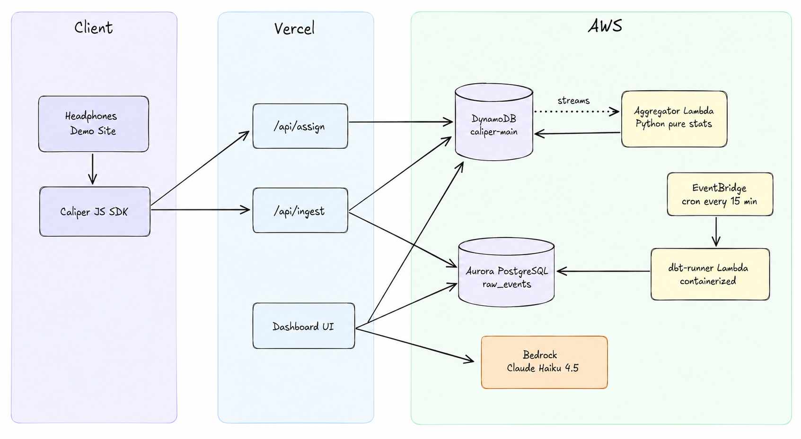

# Caliper

> Statistical rigor without the price tag.

A B2B A/B testing platform with always-valid sequential testing, AI-generated experiment readouts, and a real-time statistics engine.


**[Live Dashboard](https://caliper-xi.vercel.app)** · **[Live Demo Site](https://caliper-r5q3.vercel.app/)** · **Demo Video** \<TODO: link after recording\>

---

## The Problem

Running an A/B test looks simple: split traffic, wait, check the p-value. The trap is in that last step. If you check your p-value before the experiment reaches its planned sample size — which virtually every PM does, every day — you're playing a different game than the statistics assume. Classical p-values are calibrated for a single decision at the end. Check them repeatedly and your false positive rate climbs well above 5%, regardless of what the number says.

Caliper addresses this with mSPRT (mixture Sequential Probability Ratio Test), which produces *always-valid* p-values that remain correctly calibrated no matter how often you peek. Here is what that looks like in practice on a real experiment in the live demo:

> *"The classical p-value looks promising at 0.0061, but the always-valid p-value is 0.3650 — a classic sign of peeking. After only 3 days, you're seeing a 25% lift in add-to-cart rate, but this could easily be noise. The mSPRT method, which accounts for continuous monitoring, says the evidence isn't yet strong enough to call a winner."*

The second failure mode Caliper guards against is Sample Ratio Mismatch (SRM): when the traffic split between variants drifts from the intended 50/50. An SRM makes all statistical conclusions invalid, but it's invisible without an explicit detector. The live demo includes a deliberately misconfigured experiment (60/40 split) that triggers the SRM banner. When SRM fires, the AI verdict is unambiguous:

> *"Sample ratio mismatch detected: treatment received 38% of traffic while control received 62%, indicating a broken randomization process. Results cannot be trusted and should not inform any decision."*

Tools like Statsig and Eppo solve these problems well, but they're priced for established companies. Caliper is a hackathon-scale demonstration that you can build statistically rigorous A/B testing infrastructure without the enterprise price tag.

---

## Features

- **Real-time stats engine** computing z-test, Welch's t-test, CUPED variance reduction, mSPRT sequential testing, and χ² SRM detection — all triggered live from DynamoDB Streams.
- **Always-valid p-values via mSPRT** — peek at experiments continuously without inflating false positives, powered by a Gaussian mixture prior over effect sizes (Johari, Pekelis, Walsh 2015).
- **AI-generated readouts** via Amazon Bedrock (Claude Haiku 4.5) that produce structured verdicts with plain-English summaries, one-sentence recommendations, and confidence ratings.
- **CUPED variance reduction** — adjusts for pre-experiment behavior to narrow confidence intervals and shorten experiments needed to reach significance (Deng, Xu, Kohavi, Walker 2013).
- **Pure Python statistical library** — all five methods implemented from first principles with no scipy dependency; validated against scipy reference values via 33 unit tests.
- **dbt-modeled segment analytics** — device and country breakdowns materialized every 15 minutes via a containerized dbt Lambda on EventBridge.
- **Dual-database architecture** — DynamoDB for sub-millisecond hot reads and real-time streaming, Aurora PostgreSQL Serverless v2 for dbt-compatible SQL and historical analytics.
- **Lightweight JavaScript SDK** — cyrb53 hash-based variant assignment with API fallback, batched event delivery, localStorage identity persistence, and a developer overlay panel.
- **Six-page dashboard** — workspace overview with KPI sparklines, experiment list, experiment detail with lift trend and funnel charts, metric registry, and settings browser.

---

## Architecture



*A B2B experimentation platform: lightweight SDK ingests events through Vercel API routes, dual-writes to DynamoDB (hot) and Aurora (warm); DynamoDB Streams trigger the real-time aggregator Lambda; dbt runs on a 15-minute schedule via EventBridge; Bedrock generates AI readouts on-demand.*

### Data flow detail

The diagram below shows the same architecture as a Mermaid graph — useful for understanding edges and relationships:


**Request flow, step by step:**

1. The headphones demo site loads the Caliper SDK and calls `/api/assign` for each running experiment, getting a deterministic variant for the user.
2. As the user scrolls and clicks, the SDK batches events (flush at 10 events or 500 ms) and POSTs them to `/api/ingest`.
3. The ingest API dual-writes: DynamoDB (`EVT#` and `ASSIGN#` items) for real-time aggregation, Aurora `raw_events` for dbt analytics.
4. DynamoDB Streams trigger the aggregator Lambda (Python 3.12, arm64). For each batch, it increments `SUMMARY#` counters, computes z-test + mSPRT + CUPED, updates `ASSIGN_COUNT#` per-variant, checks SRM, and writes `STATS#latest` back to DynamoDB.
5. EventBridge fires the dbt-runner Lambda every 15 minutes. It runs `dbt run` + `dbt test` against Aurora, materializing `mart_segment_results`.
6. The dashboard reads `STATS#latest` from DynamoDB and `mart_segment_results` from Aurora to render charts and stat cards.
7. On demand, `/api/experiments/[id]/readout` calls Bedrock with experiment stats and returns a structured AI narrative (verdict + summary + recommendation + confidence).

---

## Stack

| Layer | Choice | Why |
|---|---|---|
| Frontend | Next.js 16 (App Router), TypeScript | Server components for fast initial render; API routes co-located with UI in the same repo |
| Styling | Tailwind CSS 4 | Zero-config utility classes with the new CSS-first config system |
| Charts | Recharts 3 | Native funnel chart support; lower bundle weight than Chart.js for our use case |
| UI primitives | Radix UI / Base UI, shadcn | Accessible headless components; shadcn as a copy-in-place pattern, not a runtime dependency |
| Hot data store | AWS DynamoDB single-table design | Sub-millisecond reads; Streams trigger real-time aggregation without polling infrastructure |
| Warm data store | AWS Aurora PostgreSQL Serverless v2 (PostgreSQL 17.7) | Full SQL compatibility for dbt; scales to zero ACUs when idle |
| Streaming aggregation | DynamoDB Streams → Lambda (batch 100, 5s window) | Event-driven; no polling, no queue, no separate message broker |
| Real-time aggregator | AWS Lambda, Python 3.12, arm64 | Triggered by DynamoDB Streams; pure Python stats = no scipy cold-start overhead |
| Stats library | Pure Python (math module only) | AS241 probit, Lentz incomplete beta, Lentz incomplete gamma — no external pip deps |
| Analytics layer | dbt-core 1.8.0 in containerized Lambda (ECR) | Declarative SQL transformations materialized every 15 minutes via EventBridge |
| Container registry | AWS ECR | Stores the dbt-runner Docker image; Lambda pulls on cold start |
| AI readouts | Amazon Bedrock, Claude Haiku 4.5 (primary), Nova Lite (fallback) | Structured JSON output with SRM-aware verdict logic; automatic model fallback |
| JS SDK | TypeScript, cyrb53 hash, localStorage | Deterministic variant assignment without a login requirement; 2 s API timeout with hash fallback |
| Deployment | Vercel (frontend + API routes), AWS (Lambda, DynamoDB, Aurora, ECR) | Vercel handles TypeScript builds and edge caching; AWS handles stateful compute |

---

## Statistical Methods

### Sample Ratio Mismatch Detection

Every A/B test should receive traffic in the intended ratio (usually 50/50). When the observed split deviates significantly — due to a bug in assignment logic, a caching layer intercepting requests, or a logging error — all computed p-values are invalid.

Caliper runs a χ² goodness-of-fit test on unique user assignment counts (not event counts, which inflate when users fire multiple events). The significance threshold is α = 0.0001, matching the standard used by Statsig and Eppo in production: conservative enough to avoid false positives on normal statistical variation, tight enough to catch real breakage. When SRM is detected, the AI readout verdict is locked to `srm_invalidated` regardless of the p-value.

### CUPED Variance Reduction

CUPED (Controlled-experiment Using Pre-Experiment Data) reduces the variance of your metric estimate by adjusting for a pre-experiment covariate — typically the same metric measured in the period before the experiment began. The formula is:

```
Y_cuped = Y − θ · (X − X̄)
```

where Y is the conversion outcome, X is pre-experiment activity (a Beta(2,5) covariate in the synthetic data), X̄ is the grand mean across *all* variants (using per-variant means would bias the estimate), and θ = Cov(Y, X) / Var(X). The implementation follows Deng, Xu, Kohavi, and Walker (2013). Lower variance means narrower confidence intervals, which means you can reach a statistically powered decision with fewer users or fewer days of data. The aggregator Lambda computes θ from pooled `ASSIGN#` items each time it runs, and writes the CUPED-adjusted lift CI alongside the standard z-test results.

### mSPRT — Always-Valid Sequential Testing

Classical hypothesis testing assumes you look at the data exactly once, at a pre-specified sample size. In practice, every team checks their dashboard early and often. Every additional peek is an additional chance to observe a spurious significant result, inflating the true false positive rate above the nominal α even when the displayed p-value looks fine. This is known as the peeking problem, and it's endemic in how A/B tests are actually run.

mSPRT (Johari, Pekelis, Walsh 2015) solves this with a likelihood ratio test under a Gaussian mixture prior N(0, τ²) on the effect size. The key property: E[Λ | H₀] = 1 at every point in time — the Bayes factor property under the null — so the always-valid p-value can be checked continuously without inflating Type I error. Caliper uses τ = 0.1, calibrated for typical conversion-rate experiments where effects in the 1–15% range are meaningful.

When classical and mSPRT p-values disagree, the AI readout explicitly calls it out rather than reporting a false winner. Here is what that looks like on a real experiment in the live demo:

> *"The classical p-value looks promising at 0.0061, but the always-valid p-value is 0.3650 — a classic sign of peeking. After only 3 days, you're seeing a 25% lift in add-to-cart rate, but this could easily be noise. The mSPRT method, which accounts for continuous monitoring, says the evidence isn't yet strong enough to call a winner."*

This is the core value proposition: surfacing divergence between the two p-values as a first-class signal, not a footnote.

### AI Readouts via Bedrock

The `/api/experiments/[id]/readout` endpoint calls Amazon Bedrock (Claude Haiku 4.5) with a structured prompt containing the full experiment statistics. The model returns a JSON object with four fields: `verdict`, `summary`, `recommendation`, and `confidence`. The prompt enforces verdict hierarchy: if SRM is detected, the verdict is always `srm_invalidated` regardless of what the p-value shows. Fallback to Amazon Nova Lite is automatic if the primary model fails.

---

## Pure Python Statistics Library

The aggregator Lambda runs in the `AWSSDKPandas-Python312-Arm64` layer, which provides numpy and pandas but not scipy. Rather than bundle scipy (adding ~30 MB to the deployment), all statistical computations are implemented from first principles in `dashboard/lambdas/aggregator/stats/`:

| Implementation | Location | Algorithm | Accuracy |
|---|---|---|---|
| Normal CDF Φ(z) | `frequentist.py` | `math.erf` — C library | Machine precision (~10⁻¹⁵) |
| Normal PPF / probit | `frequentist.py` | AS241 rational approximation (Wichura 1988) | ~10⁻⁹ |
| Regularized incomplete beta I_x(a,b) | `frequentist.py` | Lentz's continued fraction (Numerical Recipes §6.4) | Converges to 10⁻¹³ |
| Regularized incomplete gamma (χ² p-values) | `srm.py` | Series expansion + continued fraction, same split as scipy | Converges to 10⁻¹⁵ |

The mSPRT implementation in `sequential.py` uses the Bayes factor formula directly:

```
log Λ = 0.5 · log(s²/(s² + τ²)) + 0.5 · δ̂² · τ² / (s² · (s² + τ²))
```

where s² is the pooled variance of the difference and δ̂ is the observed effect. The always-valid p-value is `min(1, exp(-log Λ))`.

The CUPED implementation in `cuped.py` estimates θ from pooled data (both variants combined), applies the adjustment per-variant, then passes the adjusted means and variances to Welch's t-test for the final CI.

All five modules are cross-validated against `scipy.stats` reference values across 33 unit tests. scipy is used only as an oracle — it is not imported anywhere in the production Lambda code.

---

## DynamoDB Data Model

Caliper uses a single DynamoDB table (`caliper-main`) with a composite primary key (`PK`, `SK`) and a single GSI (`GSI1PK`, `GSI1SK`). All experiment data lives in one table; the SK prefix determines the item type:

| SK prefix | Item type | Written by | Read by |
|---|---|---|---|
| `ASSIGN#<userId>` | User-variant assignment (one per user per experiment) | `/api/assign` | Aggregator Lambda (CUPED) |
| `ASSIGN_COUNT#<variant>` | Cumulative unique assignment count per variant (for SRM) | Aggregator Lambda | Aggregator Lambda (SRM check) |
| `EVT#<tsMs>#<userId>#<eventName>` | Individual event (30-day TTL) | `/api/ingest` | Aggregator Lambda |
| `SUMMARY#<variant>` | Running totals: n, conversions, sum, sum_sq | Aggregator Lambda (ADD) | Dashboard via `/api/experiments/[id]/results` |
| `STATS#latest` | z-stat, p-value, lift, CI, mSPRT p-value | Aggregator Lambda | Dashboard |
| `STATS#cuped#<variant>` | CUPED-adjusted mean, variance, θ, variance reduction ratio | Aggregator Lambda | Dashboard |
| `STATS#cuped#latest` | CUPED-adjusted lift CI | Aggregator Lambda | Dashboard |
| `SRM#detected` | Chi-squared stat, p-value, observed vs expected split | Aggregator Lambda | Dashboard (SRM banner) |

`PK` is always `EXP#<experimentSlug>`. The GSI inverts to `USER#<userId>` for user-centric queries. SUMMARY counters use DynamoDB's atomic `ADD` operation, so concurrent Lambda invocations never corrupt the totals.

---

## Repository Structure

```
caliper/
├── web/                          # Caliper Arc Pro — headphones e-commerce demo site
│   ├── app/                      # Next.js App Router pages and page-level components
│   ├── components/               # Shared React UI components
│   └── lib/caliper/              # Caliper JavaScript SDK
│       ├── sdk.ts                # CaliperClient, EventBuffer, cyrb53 hash assignment
│       ├── useCaliperVariant.ts  # React hook: assign + fire experiment_exposed
│       ├── experiments.ts        # Experiment ID constants
│       └── CaliperDevPanel.tsx   # Developer overlay (variant badges, event log)
│
├── dashboard/                    # Caliper SaaS product
│   ├── app/                      # Next.js App Router (dashboard, experiments, metrics, settings)
│   │   └── api/                  # 12 API routes (assign, ingest, experiments, readout, etc.)
│   ├── components/               # Charts, tables, cards, and layout components
│   ├── lib/                      # Bedrock client, Postgres pool, DynamoDB helpers, timeseries SQL
│   ├── lambdas/
│   │   ├── aggregator/           # Real-time stats Lambda — pure Python, no scipy
│   │   │   ├── stats/            # z-test, Welch's t, CUPED, mSPRT, SRM
│   │   │   ├── handler.py        # DynamoDB Streams entrypoint
│   │   │   └── tests/            # 33 unit tests (cross-validated against scipy)
│   │   └── dbt-runner/           # Containerized dbt Lambda deployed via ECR
│   ├── analytics/                # dbt project: 4 models (staging → intermediate → mart)
│   └── scripts/                  # Synthetic data generator (~10k events, 3 experiments)
│
└── README.md                     # You are here
```

---

## Demo Experiments

The live demo runs three synthetic experiments seeded with ~3,333 users per variant:

| Experiment | What it tests | Primary metric | Notes |
|---|---|---|---|
| Hero CTA Test | Adds a gold CTA button to the hero section | `buy_section_view` | Classical p < 0.05, mSPRT p ≈ 0.53 — peeking trap demo |
| Buy Button Test | Add-to-cart button styling on the product page | `add_to_cart` | Similar mSPRT divergence story |
| Nav Layout Test | Navigation layout variant | `nav_cta_click` | Deliberately 60/40 split — SRM banner fires |

The Nav Layout Test is intentionally misconfigured to demonstrate SRM detection before anyone makes a decision on invalid data.

To see all three in the dashboard: visit [caliper-xi.vercel.app](https://caliper-xi.vercel.app), navigate to `/experiments`, and click into any experiment. The Hero CTA Test and Buy Button Test illustrate the mSPRT vs classical p-value divergence. The Nav Layout Test shows the SRM banner and the locked `srm_invalidated` AI verdict.

**Demo API key**: `caliper_demo_key_public`

---

## Running Locally

```bash
# Headphones demo site — http://localhost:3000
cd web
npm install
cp .env.local.example .env.local   # set NEXT_PUBLIC_CALIPER_API_URL and NEXT_PUBLIC_CALIPER_API_KEY
npm run dev

# Dashboard — http://localhost:3001
cd dashboard
npm install
cp .env.local.example .env.local   # set DATABASE_URL, AWS credentials, DYNAMODB_TABLE_NAME, BEDROCK_MODEL_ID
npm run dev
```

The demo site can point at the live API (`https://caliper-xi.vercel.app`) with `NEXT_PUBLIC_CALIPER_API_KEY=caliper_demo_key_public` for a no-infrastructure local run. The full stack — with a local Lambda, local Aurora, and local Bedrock — requires AWS credentials, an Aurora PostgreSQL connection string, and Bedrock model access in `us-east-1`.

To run the 33 aggregator unit tests without any AWS infrastructure:

```bash
cd dashboard/lambdas/aggregator
pip install -r ../../scripts/requirements.txt
python -m pytest tests/ -v
```

Required environment variables for each service are documented in [`web/README.md`](web/README.md) and [`dashboard/README.md`](dashboard/README.md).

---

## What's Out of Scope

Caliper is a hackathon submission with a clearly bounded scope. The following were explicitly deferred rather than half-built:

- **Multi-variant testing** (A/B/C/D) — two-variant binary experiments only
- **Bayesian methods** — frequentist-only; Bayesian testing is a different product philosophy
- **Feature flags / kill switches** — different product category, separate concern
- **Multi-tenant auth** — single demo customer, single API key; no login flow
- **Billing / subscriptions** — not in scope for the hackathon
- **Notifications** — no Slack, email, or webhook alerts
- **Mobile SDKs** — JavaScript SDK only

Keeping scope tight meant the features that are here could be built carefully.

---

## Acknowledgments

Statistical methods draw from:

- Deng, A., Xu, Y., Kohavi, R., & Walker, T. (2013). *Improving the sensitivity of online controlled experiments by utilizing pre-experiment data.* WSDM '13.
- Johari, R., Pekelis, L., & Walsh, D. J. (2015). *Always valid inference: Continuous monitoring of A/B tests.*
- Wichura, M. J. (1988). *Algorithm AS241: The percentage points of the normal distribution.* Applied Statistics, 37(3), 477–484.

---

## License

Code released under the MIT License. Built as a hackathon submission — not currently maintained as a production product.
